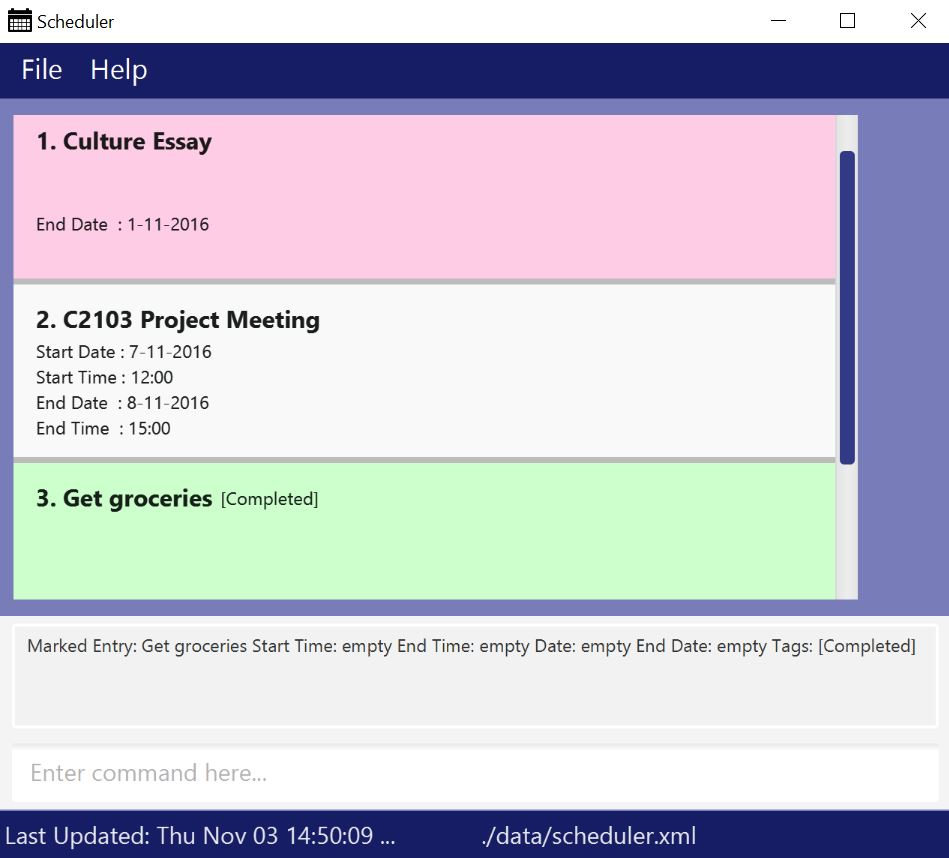

<!-- @@author A0139956L -->

# Scheduler

 

* This is a desktop Scheduler application. It has a GUI but most of the user interactions happen using 
  a CLI (Command Line Interface).
* This application is a CS2103 project and is still undergoing development.
* Our latest release: [v0.4](https://github.com/CS2103AUG2016-T15-C2/main/releases/tag/v0.4)
<!-- @@author -->
  
#### Site Map
* [User Guide](docs/UserGuide.md) 
* [Developer Guide](docs/DeveloperGuide.md) 
* [Learning Outcomes](docs/LearningOutcomes.md) 
* [About Us](docs/AboutUs.md)
* [Contact Us](docs/ContactUs.md)

#### Acknowledgements

* This application was adapted from a CS2103 sample application, [AddressBook-Level 4](https://github.com/nus-cs2103-AY1617S1/addressbook-level4) designed and built by *Assoc. Prof Damith C. Rajapakse* and his teaching team. 
* Some parts of this sample application were inspired by the excellent 
  [Java FX tutorial](http://code.makery.ch/library/javafx-8-tutorial/) by *Marco Jakob*. 

#### Licence : [MIT](LICENSE)
