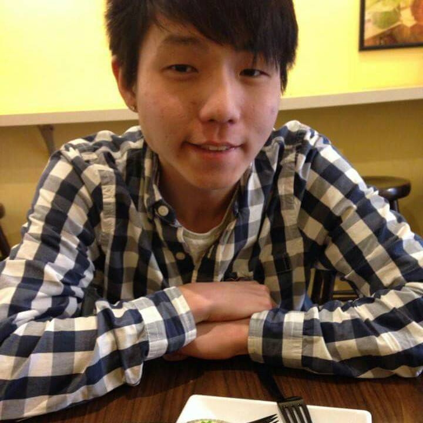
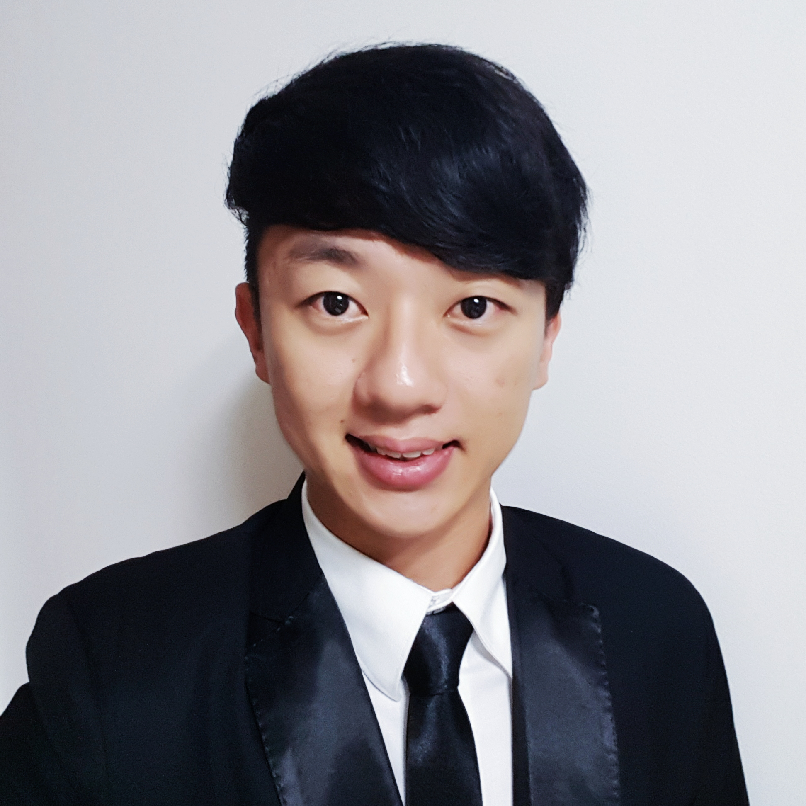
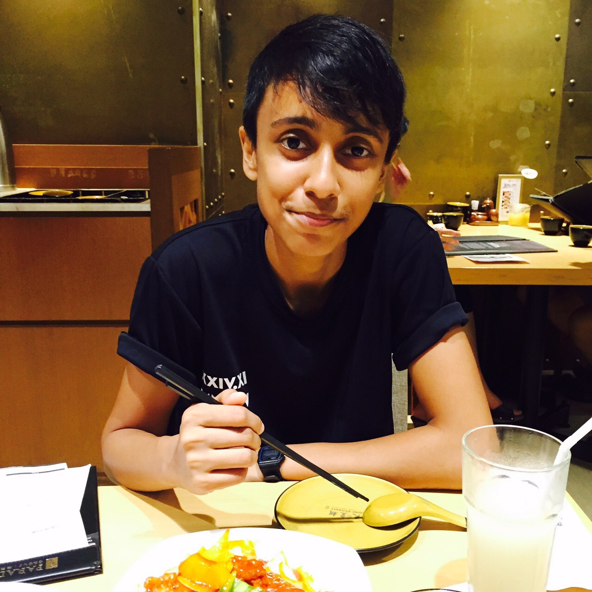
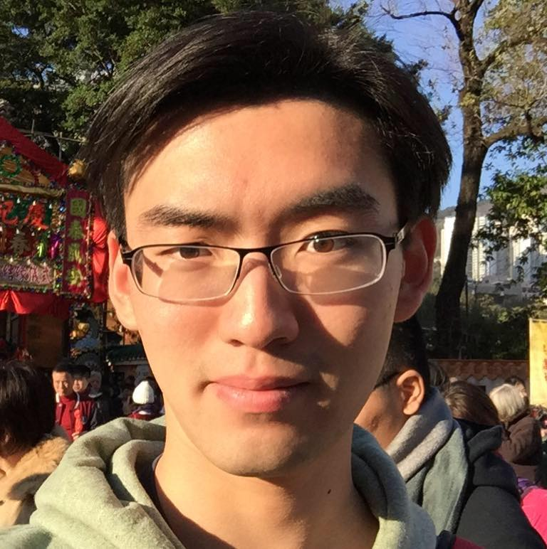

# About Us

We are a team based in the [School of Computing, National University of Singapore](http://www.comp.nus.edu.sg).

## Project Team

#### [Ang Kiang Siang](https://docs.google.com/document/u/1/d/1O3HF7qsh6KVeLesPmcQ0nPxSqhrkJxvS-OA_g-k-two/pub?embedded=true)  
 
Role: Project Mentor   

-----

#### [Chankyu Oh](github.com/chankyuoh)  
 
Role: Code Quality Manager    
Responsibilities: Look after code quality, ensures adherence to coding standards, etc.
Deliverables and deadlines: Ensure project deliverables are done on time and in the right format.

-----

#### Leow Zheng Yu [@zhengyu92](http://github.com/zhengyu92)
 

* Components in charge of: [Storage](https://github.com/CS2103AUG2016-T15-C2/main/blob/master/docs/DeveloperGuide.md#storage-component)
* Aspects/tools in charge of: Features, Testing, Documentation, Git 
* Features implemented:
   * [Path filePath](https://github.com/CS2103AUG2016-T15-C2/main/blob/master/docs/UserGuide.md#changing-the-file-save-path--path)
* Code written: [functional code][test code][docs]
* Other major contributions:
   * Did the initial refactoring from AddressBook to Scheduler [[#37](https://github.com/CS2103AUG2016-T15-C2/main/pull/37)][[Merge base0.1 to master](https://github.com/CS2103AUG2016-T15-C2/main/commit/7eefac7edcd4b76712dfd52906980656fd9a6998)]
   * Set up Travis
   
-----

#### [Niveetha](http://github.com/niveetha)
 
Role: Team Lead   
Responsibilities: Responsible for overall project coordination.

-----

#### [Hendersen Lam](http://github.com/takukou)
 
Role: Testing Manager    
Responsibilities: Ensures the testing of the project is done properly and on time.

 
 -----

# Contributors

We welcome contributions. See [Contact Us](ContactUs.md) page for more info.

