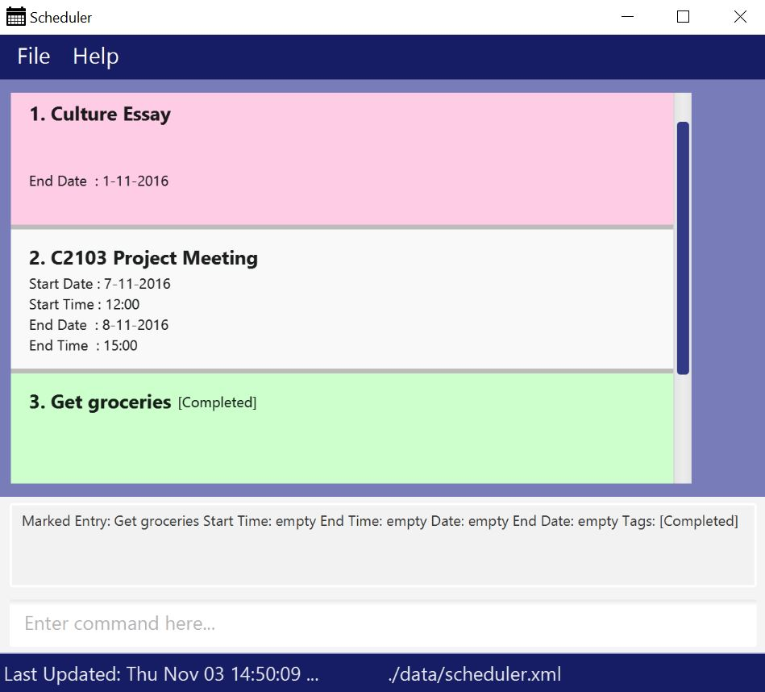

# User Guide

* [Quick Start](#quick-start)
* [Features](#features)
* [FAQ](#faq)
* [Command Summary](#command-summary)

## Quick Start

0. Ensure you have Java version `1.8.0_60` or later installed in your Computer. 
   > Having any Java 8 version is not enough.  
   This app will not work with earlier versions of Java 8.
<!-- @@author A0139956L -->   
1. Download the latest `scheduler.jar` from the [releases](../../../releases) tab.
2. Copy the file to the folder you want to use as the home folder for your Scheduler.
3. Double-click the file to start the app. The GUI should appear in a few seconds. 
   > 
4. Type the command in the command box and press <kbd>Enter</kbd> to execute it.  
   e.g. typing **`help`** and pressing <kbd>Enter</kbd> will open the help window. 
5. Some example commands you can try:
   * **`list`** : lists all items
   <!-- @@author A0126090N --> 
   * **`add`**: `add Meeting from/13:00 to/17:00 sd/19-02-2016 ed/20-02-2016 [t/priority]` : 
     adds an item named `Meeting` to the scheduler.
   * **`delete`**` 3` : deletes the 3rd item shown in the scheduler
   * **`exit`** : exits the app
   * **`add`**: `add Homework by/20-02-2016`: adds an item `Homework` with only 1 parameter
   * **`add`**: `add Homework ed/20-02-2016`: adds an item `Homework` with only 1 parameter (notice that by/ and ed/ are interchangeable) <!-- @@author -->
6. Refer to the [Features](#features) section below for details of each command. 

## Features
> **Command Format**
> * All the parameters for the add and edit command (other than the name or index number, respectively) are optional. For example, if you only want to put in info for the end date, simply do `add NAME ed/12-12-2016` instead of filling out every paramter 
> * Words in `UPPER_CASE` are the parameters.
> * Items in `SQUARE_BRACKETS` are optional.
> * Items with `...` after them can have multiple instances.
> * The order of parameters is fixed.
<!-- @@author A0161210A --> 
> * parameter marker `st/` is interchangeable with: `from/` `f/`
> * parameter marker `et/` is interchangeable with: `to/`
> * parameter marker `sd/` is interchangeable with: `sdate/`
> * parameter marker `ed/` is interchangeable with: `edate/` or `d/` `date/` or `by/` (in case of a deadline task) 
<!-- @@author --> 
#### Viewing help : `help`
Format: `help`

> Help is also shown if you enter an incorrect command e.g. `abcd`

<!-- @@author A0126090N --> 
#### Adding an item: `add`
Adds an event to the scheduler. Advanced users can type `a` instead. 
Format: `add NAME [st/START_TIME] [et/END_TIME] [sd/START_DATE] [ed/END_DATE] [t/TAG]` 
Format: `a NAME [st/START_TIME] [et/END_TIME] [sd/START_DATE] [ed/END_DATE] [t/TAG]` 

> * Current date is added by default when start/end time is added to scheduler without a date.
<!-- @@author A0161210A --> 
Examples: 
* `add Meeting st/12:00 et/17:00 sd/19-02-16 ed/20-02-16 t/priority`
* `add Gathering from/19:00 to/23:00 d/24-05-16 t/priority`
* `add Do Homework1 ed/19-02-2016`
* `a Do Homework2 by/20-02-2016`
<!-- @@author -->

#### Listing all items: `list`
Shows a list of all items in the scheduler. User can also type `l` instead of `list` 
Format: `list` 
Examples: 
* `list`
* `l`

<!-- @@author A0152962B -->
#### Editing an item : `edit`
Edits a full event to the scheduler specified by the index. User can also type `e` instead of `edit`  
Format: `edit INDEX NUMBER st/START_TIME et/END_TIME sd/START_DATE ed/END_DATE t/TAG` 
Format: `e INDEX NUMBER st/START_TIME et/END_TIME sd/DATE ed/END_DATE t/TAG` 

Edits a deadline task to the scheduler specified by the index  
Format: `edit INDEX NUMBER ed/DATE` 
Format: `e INDEX NUMBER ed/DATE` 

Edits a floating task to the scheduler specified by the index  
Format: `edit INDEX NUMBER` 
Format: `e INDEX NUMBER`  
Examples: 
* `edit 1 Meeting st/12:00 et/17:00 ed/19-02-16 t/priority`
* `edit 3 Do Homework1 ed/19-02-12`
* `e 2 Do Homework2`   
<!-- @@author A0161210A --> 
Important Note: The Edit functionality works more like a Replace command. Consider these 2 cases.  
* 1)if user has a fully filled out event, but only wants to edit the end time parameter, user will have to type out every paramter, and only change the end time parameter to the desired paramter.
* 2)If user has a fully filled out event, but wants to edit it to a deadline task, user should only type in the endDate and endTime parameter
<!-- @@author A0152962B-->

#### Undo recent actions (up to 10): `undo`
Reverts scheduler back to the state before the recent committed actions (up to 10 undoable commands). 
Undoable commands include: `add` `delete` `edit` `mark` `clear` 
Format: `undo`

>Undo stack holds up to 10 recent undoable comments.
>Does not display a text feedback to user.

#### Redo recent undone actions: `redo`
Reverts scheduler back to the state before the recent undone actions. 
Format: `redo`

>Redo stacks clears upon a new valid commmand.
>Does not display a	text feedback to user.
<!-- @@author -->

#### Deleting an item: `delete`
Delete the item selected by the user. User can also type `d` instead of `delete` 
Format: `delete INDEX`
Format: `d INDEX`

> * The user needs to view Scheduler in a list to find index of item

Examples: 
* `delete 23`
* `d 3`

#### Finding all items containing any keyword in their name: `find`
Finds items where their item names contain any of the given keywords. User can also type `f` instead of `find` 
Format: `find KEYWORD [MORE_KEYWORDS]`
Format: `f KEYWORD [MORE_KEYWORDS]`

> * The search is non-case sensitive. e.g `homework` will match `Homework`
> * Only the name is searched.
> * Only full words will be matched e.g. `CS` will not match `CS2103`
> * Persons matching at least one keyword will be returned (i.e. `OR` search).
    e.g. `Midterm` will match `Midterm Review`

Examples: 
* `find Tutorial` 
  Returns `CS2103 Tutorial` and words related to `tutorial`
* `f CS Assignment Errand` 
  Returns Any item having names `CS`, `Assignment`, or `Errand`

<!-- @@author A0161210A --> 
#### Finding all items that have been completed or incompleted: `find [completed or incompleted]`
Finds and lists items that have been marked as completed or not marked as completed. The keyword `completed` and `incompleted` also have advanced command shortcuts  
Format: `find complete`, `find completed`, `find c`  
Format: `find incomplete`, `find incompleted`, `find i`  
 
Note: Advanced users can use advanced command input for find in conjunction to type `f c` or `f i` for the quickest shortcut

Examples:
* `find completed` 
* `f c`  
* `f incomplete` 
  
<!-- @@author A0126090N --> 
#### Marking an entry as completed: `mark`
Marks an entry as completed in the scheduler. User can also type `m` instead of `mark`. Marked entries will have a tag: `completed`, and be highlighted in green  
Format: `mark INDEX` 
Format: `m INDEX` 

> * Marked entry will move to the end of the scheduler.
> * If list was called before 'mark', the filtered list will exit and marked entry will be displayed on the unfiltered scheduler.

<!-- @@author A0139956L -->
#### Specify a folder as data storage location: `path`
Data storage location can be manually changed to a user-specified location. User can also type `p` instead of `path` 
Format: `path FILE_PATH` 
Format: `p FILE_PATH`

Examples:
* `path data/week1`
* `p data/week1`

> * To create the file, add an entry to the scheduler after the path command.

<!-- @@author A0126090N --> 
#### Clear scheduler of all entries: `clear`
Deletes all entries in the scheduler. User can also type `c` instead of `clear` 
Format: `clear`
Format: `c`

> * A prompt will pop up when function is called to confirm action.
<!-- @@author --> 

#### Exiting the program : `exit`
Exits the program. User can also type `ex` instead of `exit` 
Format: `exit`
Format: `ex`

## FAQ

**Q**: How do I transfer my data to another Computer? 
**A**: Install the app in the other computer and overwrite the empty data file it creates with 
       the file that contains the data of your previous Scheduler folder.  
<!-- @@author A0139956L-->
**Q**: What does the entry highlighted in red means? 
**A**: The entry requires attention because it is either overdue or due today.  
**Q**: What does the entry highlighted in green means? 
**A**: The entry is marked completed.  

<!-- @@author A0126090N --> 
## Command Summary

Command | Format  
-------- | :-------- 
Help | `help`
Add | `add NAME [st/START_TIME] [et/END_TIME] [sd/START_DATE] [ed/END_DATE] [t/TAG]`
Add | `a NAME [st/START_TIME] [et/END_TIME] [sd/START_DATE] [ed/END_DATE] [t/TAG]`
List | `list`
List | `l`
Edit | `edit INDEX [st/START_TIME] [et/END_TIME] [sd/START_DATE] [ed/END_DATE] [t/TAG]`
Edit | `e INDEX [st/START_TIME] [et/END_TIME] [sd/START_DATE] [ed/END_DATE] [t/TAG]`
Undo | `undo` 
Redo | `redo`
Delete | `delete INDEX`
Delete | `d INDEX`
Find | `find KEYWORD [MORE_KEYWORDS]`
Find | `f KEYWORD [MORE_KEYWORDS]`
Find | `find completed`
Find | `find incompleted`
Mark | `mark INDEX`
Mark | `m INDEX`
Path | `path FILE_PATH`
Path | `p`
Clear | `clear`
Clear | `c`
Exit | `exit`
Exit | `ex`
